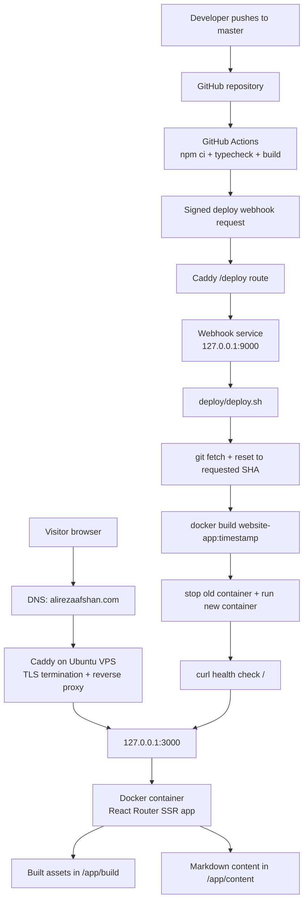

# Alireza Afshan Website

Personal site built with React Router, TypeScript, Tailwind CSS, and Docker.

[](https://stackblitz.com/github/remix-run/react-router-templates/tree/main/default)

## Features

- 🚀 Server-side rendering
- ⚡️ Hot Module Replacement (HMR)
- 📦 Asset bundling and optimization
- 🔄 Data loading and mutations
- 🔒 TypeScript by default
- 🎉 TailwindCSS for styling
- 📖 [React Router docs](https://reactrouter.com/)

## Getting Started

### Installation

Install the dependencies:

```bash
npm install
```

### Development

Start the development server with HMR:

```bash
npm run dev
```

Your application will be available at `http://localhost:5173`.

## Building for Production

Create a production build:

```bash
npm run build
```

## Deployment

### Docker

To build and run using Docker:

```bash
docker build -t website-app .

docker run -p 127.0.0.1:3000:3000 website-app
```

### CI/CD

Pushes to `master` run `.github/workflows/deploy.yml`. The workflow installs
dependencies, runs `npm run typecheck`, runs `npm run build`, and only then
calls the server deploy webhook.

Required GitHub secrets:

- `DEPLOY_WEBHOOK_URL`: HTTPS URL for the deploy webhook, ending in `/deploy`.
- `DEPLOY_WEBHOOK_SECRET`: shared HMAC signing secret.

The webhook validates `X-Hub-Signature-256`, accepts only the configured event
and branch, and runs `deploy/deploy.sh`.

Server secrets and deployment settings belong in `/etc/website-deploy.env`, not
in git. Start from `deploy/website-deploy.env.example`.

The Caddy config is intentionally server-managed. Caddy should terminate TLS and
reverse proxy the public site to the app container's local port, for example
`127.0.0.1:3000`, and proxy the deploy webhook URL to the local webhook service,
for example `127.0.0.1:9000`.

## Styling

This template comes with [Tailwind CSS](https://tailwindcss.com/) already configured for a simple default starting experience. You can use whatever CSS framework you prefer.

## Content authoring

This site now keeps authored content in-repo.

- Projects live in `content/projects/*.md`
- Blog posts live in `content/blog/*.md`
- Project and blog images live in `public/images/...`
- The resume page content lives in `app/content/resume.ts`

Markdown entries use frontmatter plus body content. Image references should use site-relative paths such as `/images/blog/my-post/cover.svg`.

## Copy replacement TODO

Use this section as a working checklist when rewriting page copy.

- Home page: replace the hero eyebrow in `app/routes/home.tsx` with the exact positioning you want visitors to remember.
- Home cards: rewrite the card summaries for About, Blog, Projects, and Resume in `app/routes/home.tsx`.
- About page: replace the page intro, profile paragraphs, and focus tags in `app/routes/about.tsx`.
- Projects page: replace the page intro in `app/routes/projects.tsx`.
- Project entries: rewrite the frontmatter summaries and markdown body sections in `content/projects/*.md`.
- Blog index: replace the page intro in `app/routes/blog.tsx`.
- Blog posts: rewrite titles, summaries, publish dates, tags, and bodies in `content/blog/*.md`.
- Resume page: update the intro in `app/routes/resume.tsx` and the structured resume data in `app/content/resume.ts`.
- Footer/contact: confirm the displayed footer email in `app/components/page-shell.tsx` and resume contact links in `app/content/resume.ts`.
- Metadata: update route `meta()` titles and descriptions in each route after the visible copy is final.

## System overview



---

Built with ❤️ using React Router.
