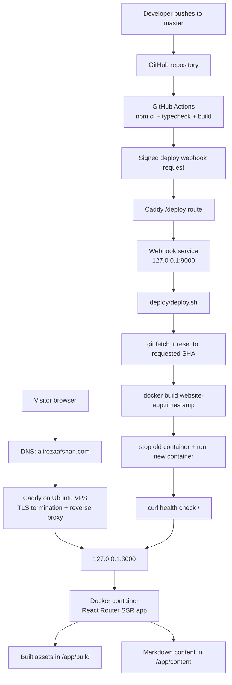

# Alireza Afshan Website

Personal portfolio site for Alireza Afshan, built with React Router, TypeScript,
Tailwind CSS, markdown-backed content, Docker, Caddy, and a signed deploy
webhook.

## Stack

- React Router SSR
- TypeScript
- Tailwind CSS
- Markdown content with frontmatter
- Docker production image
- GitHub Actions validation and deploy webhook

## Local development

Install dependencies:

```bash
npm install
```

Start the development server:

```bash
npm run dev
```

The app runs at `http://localhost:5173`.

Run checks before pushing:

```bash
npm run typecheck
npm run build
```

## Deployment

### Docker

To build and run using Docker:

```bash
docker build -t website-app .

docker run -p 127.0.0.1:3000:3000 website-app
```

### CI/CD

Pushes to `master` run `.github/workflows/deploy.yml`. The workflow installs
dependencies, runs `npm run typecheck`, runs `npm run build`, and only then
calls the server deploy webhook.

Required GitHub secrets:

- `DEPLOY_WEBHOOK_URL`: HTTPS URL for the deploy webhook, ending in `/deploy`.
- `DEPLOY_WEBHOOK_SECRET`: shared HMAC signing secret.

The webhook validates `X-Hub-Signature-256`, accepts only the configured event
and branch, and runs `deploy/deploy.sh`.

Server secrets and deployment settings belong in `/etc/website-deploy.env`, not
in git. Start from `deploy/website-deploy.env.example`.

The Caddy config is intentionally server-managed. Caddy should terminate TLS and
reverse proxy the public site to the app container's local port, for example
`127.0.0.1:3000`, and proxy the deploy webhook URL to the local webhook service,
for example `127.0.0.1:9000`.

## Content authoring

Authored content lives in-repo.

- Projects live in `content/projects/*.md`
- The Showcase page pulls its live links from project `liveUrl` frontmatter
- Archived blog posts remain in `content/blog/*.md`, but are no longer routed publicly
- Project images live in `public/images/projects/...`
- The resume page content lives in `app/content/resume.ts`

Project markdown uses frontmatter plus `personal-notes` and `ai-summary` body
sections. Image references should use site-relative paths such as
`/images/projects/my-project/cover.png`.

### Public site link contract

- Every standalone public site exposes a visible link back to `https://alirezaafshan.com`.
- Every deployed public site has a project entry with a `liveUrl`, which makes it available from Showcase.
- Confirm each repository's actual deploy branch before release; do not assume `main` or `master`.
- Do not add a `liveUrl` for a prototype until the public deployment exists.

## Copy maintenance notes

Use this section as a quick map when refreshing page copy.

- Home page: replace the hero eyebrow in `app/routes/home.tsx` with the exact positioning you want visitors to remember.
- Home cards: rewrite the card summaries for About, Showcase, Projects, and Resume in `app/routes/home.tsx`.
- About page: replace the page intro, profile paragraphs, and focus tags in `app/routes/about.tsx`.
- Projects page: replace the page intro in `app/routes/projects.tsx`.
- Project entries: rewrite the frontmatter summaries and markdown body sections in `content/projects/*.md`.
- Showcase page: update live-site copy and the construction crew in `app/routes/showcase.tsx`.
- Archived blog URLs redirect to Showcase through `app/routes/blog.tsx` and `app/routes/blog-post.tsx`.
- Resume page: update the intro in `app/routes/resume.tsx` and the structured resume data in `app/content/resume.ts`.
- Footer/contact: confirm the displayed footer email in `app/components/page-shell.tsx` and resume contact links in `app/content/resume.ts`.
- Metadata: update route `meta()` titles and descriptions in each route after the visible copy is final.

## System overview


```mermaid
flowchart TD
  Visitor["Visitor browser"] --> DNS["DNS: alirezaafshan.com"]
  DNS --> Caddy["Caddy on Ubuntu VPS\nTLS termination + reverse proxy"]
  Caddy --> AppPort["127.0.0.1:3000"]
  AppPort --> Container["Docker container\nReact Router SSR app"]
  Container --> StaticAssets["Built assets in /app/build"]
  Container --> Content["Markdown content in /app/content"]

  Developer["Developer pushes to master"] --> GitHub["GitHub repository"]
  GitHub --> Actions["GitHub Actions\nnpm ci + typecheck + build"]
  Actions --> SignedWebhook["Signed deploy webhook request"]
  SignedWebhook --> CaddyDeploy["Caddy /deploy route"]
  CaddyDeploy --> Webhook["Webhook service\n127.0.0.1:9000"]
  Webhook --> DeployScript["deploy/deploy.sh"]
  DeployScript --> Pull["git fetch + reset to requested SHA"]
  Pull --> BuildImage["docker build website-app:timestamp"]
  BuildImage --> Restart["stop old container + run new container"]
  Restart --> Health["curl health check /"]
  Health --> AppPort
```

---

Maintained as a personal portfolio and deployment reference.
